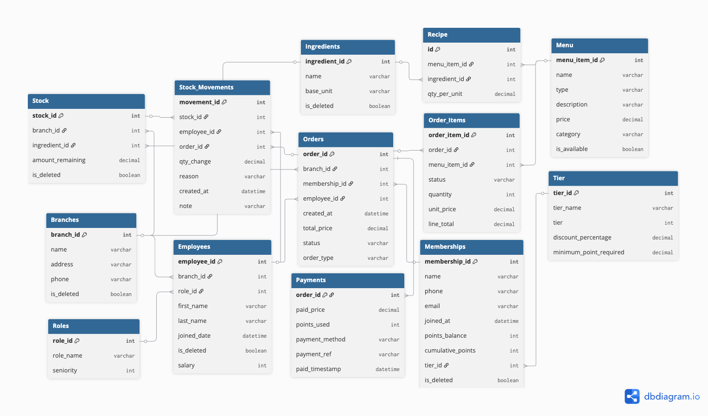

# POS System - Point of Sale

A full-stack Point of Sale system built with Next.js, FastAPI, and PostgreSQL, designed for managing retail and restaurant operations.

## Features

- **Order Management**: Create, view, and manage orders (Dine-in, Takeaway, Delivery)
- **Menu Management**: Manage menu items (products, dishes, addons, sets)
- **Inventory Management**: Track stock and ingredients with movement history
- **Membership System**: Manage customer memberships with tier-based rewards and points
- **Employee Management**: Manage employees, roles, and permissions across branches
- **Branch Management**: Manage multiple store locations
- **Payment Processing**: Process payments with multiple payment methods (Cash, Card, QR, Points)
- **Analytics Dashboard**: Sales trends, top branches, membership analytics, inventory analytics
- **Order Processing**: Real-time order status tracking (ORDERED, PREPARING, DONE, CANCELLED)

## Tech Stack

- **Frontend**: Next.js 16, React 19, Redux Toolkit, RTK Query, Tailwind CSS
- **Backend**: FastAPI, SQLAlchemy, PostgreSQL
- **Containerization**: Docker, Docker Compose

## Database Schema

### Entity-Relationship Diagram



### Tables Overview

The system includes 13 main tables organized by domain:

#### Core & Reference Tables
- **Branches**: Store locations with address and contact information
- **Roles**: Employee roles with seniority levels (Manager, Chef, Cashier, etc.)
- **Tiers**: Membership tier levels (Bronze, Silver, Gold, Platinum) with discount percentages

#### People & Staff
- **Employees**: Staff members assigned to branches with roles and salary information
- **Memberships**: Customer membership program with points balance, tier assignment, and contact details

#### Inventory Management
- **Ingredients**: Master list of raw materials and ingredients with base units
- **Stock**: Per-branch inventory tracking for each ingredient
- **Stock Movements**: Complete inventory change history (restock, waste, order usage) with timestamps and reasons

#### Menu & Recipes
- **Menu**: Products, dishes, sets, add-ons, and drinks with pricing and availability
- **Recipe**: Links menu items to required ingredients and quantities (bill of materials)

#### Sales & Transactions
- **Orders**: Customer orders with status tracking (UNPAID, PAID, CANCELLED), order type, and totals
- **Order Items**: Individual items within orders with preparation status (ORDERED, PREPARING, DONE, CANCELLED)
- **Payments**: Payment records linked to orders with payment method, points used, and transaction references

**Note**: All tables use PostgreSQL sequences for auto-incrementing IDs, which are automatically synchronized after seeding to prevent duplicate key errors.

## Getting Started

### Prerequisites

- Docker and Docker Compose installed
- Node.js 20+ (for local development)

### Running with Docker

1. Clone the repository and navigate to the project directory

2. Create a `.env` file (optional, defaults are provided):
   ```env
   POSTGRES_USER=posuser
   POSTGRES_PASSWORD=pospass
   POSTGRES_DB=posdb
   POSTGRES_HOST=postgres
   POSTGRES_PORT=5432
   BACKEND_PORT=8000
   FRONTEND_PORT=3000
   NEXT_PUBLIC_API_URL=http://localhost:8000
   ```

3. Start all services:
   ```bash
   docker-compose up --build
   ```

4. Initialize and seed the database:
   ```bash
   # Initialize database tables
   docker-compose exec backend python -m app.init_db
   
   # Seed database with sample data
   docker-compose exec backend python -m app.seed
   ```

5. Access the application:
   - Frontend: http://localhost:3000
   - Backend API: http://localhost:8000
   - API Documentation: http://localhost:8000/docs

### Seed Data

The seed script (`app/seed.py`) includes comprehensive sample data with **English names**:
- **3 Branches**: Siam Branch, Thonglor Branch, CentralWorld Branch
- **4 Tiers**: Bronze, Silver, Gold, Platinum
- **6 Roles**: Manager, Assistant Manager, Head Chef, Chef, Cashier, Waiter
- **18 Employees**: Distributed across all branches with various roles
- **50+ Ingredients**: Comprehensive Thai cuisine ingredients (rice, proteins, vegetables, sauces, etc.)
- **Stock Items**: Per-branch inventory for all ingredients
- **25+ Menu Items**: Main dishes, set meals, add-ons, and drinks
- **Recipes**: Complete ingredient lists for all menu items
- **10 Memberships**: With tier-based rewards and points
- **100+ Historical Orders**: Past 60 days of order data for analytics
- **Stock Movements**: Historical restock and waste records

**Important**: The seed script automatically fixes PostgreSQL sequences after seeding to prevent duplicate key errors when creating new records.

### Development

#### Backend

```bash
cd backend
pip install -r requirements.txt
uvicorn app.main:app --reload
```

#### Frontend

```bash
cd frontend
npm install
npm run dev
```

## Project Structure

```
POS/
├── docker-compose.yml
├── backend/
│   ├── Dockerfile
│   ├── requirements.txt
│   └── app/
│       ├── main.py
│       ├── database.py
│       ├── models.py
│       ├── schemas.py
│       ├── seed.py
│       ├── init_db.py
│       └── routers/
├── frontend/
│   ├── Dockerfile
│   ├── package.json
│   └── src/
│       ├── app/
│       ├── store/
│       └── components/
```

## API Endpoints

All API endpoints are prefixed with `/api`:

- `/api/roles` - Role management
- `/api/employees` - Employee management
- `/api/branches` - Branch management
- `/api/memberships` - Membership management
- `/api/stock` - Stock/inventory management
- `/api/menu-items` - Menu item management
- `/api/menu-ingredients` - Menu ingredient management
- `/api/orders` - Order management
- `/api/order-items` - Order item management
- `/api/payments` - Payment management

See `/docs` for interactive API documentation.

## Business Logic

- **Order Total**: Sum of all order items' line_total (excluding cancelled items)
- **Line Total**: quantity × unit_price (snapshot at time of ordering)
- **Order Status**: UNPAID, PAID, CANCELLED
- **Order Item Status**: ORDERED → PREPARING → DONE (or CANCELLED)
- **Order Types**: DINE_IN, TAKEAWAY, DELIVERY
- **Membership Tiers**: Bronze (0), Silver (1), Gold (2), Platinum (3) with tier-based discounts
- **Payment Methods**: CASH, CARD, QR, POINTS
- **Stock Movements**: RESTOCK (positive), WASTE (negative), ORDER_USAGE (negative)
- **Sequence Management**: PostgreSQL sequences are automatically synchronized after seeding to prevent duplicate key errors

## License

This project is for educational/database demonstration purposes.
